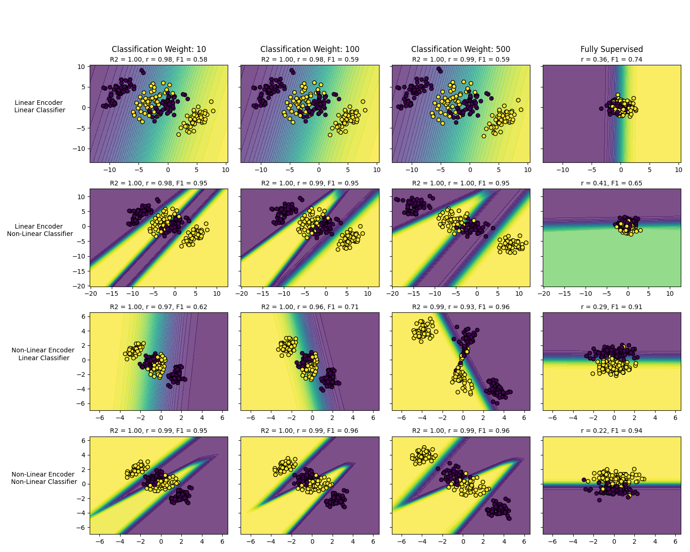

# ReadMe
# Using deep generative models for simultaneous representational and predictive modeling of brain and behavior:  
## A graded supervised-to-unsupervised modeling framework

**Kieran McVeigh, Ashutosh Singh, Deniz Erdogmus, Lisa Feldman Barrett, Ajay B. Satpute**  
[https://doi.org/10.1101/2024.12.23.630166](https://doi.org/10.1101/2024.12.23.630166)

---

### Abstract

Research in cognitive neuroscience has increasingly used machine learning algorithms and multivariate pattern analysis (MVPA) to model brain–behavior relationships. These algorithms typically fall into two main types: unsupervised or supervised. In cognitive neuroscience, most studies assume that brain states map to behavior in a linear, one-to-one fashion. If such mapping exists, unsupervised and supervised approaches should lead to converging conclusions. Conclusions diverge, however, when the mapping is more complex. Unfortunately, the ground truth of brain–behavior relationships is rarely, if ever, known in advance, leading to the possibility of incorrect conclusions when scientists use a modeling approach guided by a single set of assumptions that may not be justified.

In this paper, we introduce a possible solution to this dilemma. We combine unsupervised and discriminative supervised models with a model comparison strategy, and apply this approach on simulated data where the ground truth brain–behavior relationships are known. The combined modeling approach learns a latent space that models the distribution of simulated brain states (similar to unsupervised approaches). At the same time, the latent space contains information that can be used to predict behavior, thereby contributing to brain–behavior characterizations (similar to supervised approaches).

We use four simulated datasets that vary in the linearity and homogeneity of the brain–behavior relationship to compare the modeling results for each simulated dataset along a continuum from fully unsupervised to fully supervised. More importantly, we examine what happens to the latent space as a consequence of incorrect assumptions that applied to a dataset during modeling. We further show how our framework can model diverse brain–behavior relationships in a way that fully unsupervised vs. fully supervised approaches do not, by comparing the modeling results for each simulated dataset along a continuum from fully unsupervised to fully supervised.

Repo for https://www.biorxiv.org/content/10.1101/2024.12.23.630166v1.abstract

[](results/figures/vary_arch_betas_situation-3.png)

## Scripts

### 1) `generate_data.py`
Generate synthetic datasets used by the VAE-C experiments.
```bash
python generate_data.py 
```

### 2) `train_vae.py`
Train models for a given **situation** (dataset setup).
```bash
python train_vae.py 1
```

### 3) `generate_results_table.py`
Aggregate metrics into a results table for a given situation.
```bash
python generate_results_table.py 1 
```

### 4) `create_all_archs_vary_beta_figs_with_stats.py`
Reproduce the main figures for a given situation, including stats overlays.
```bash
python create_all_archs_vary_beta_figs_with_stats.py 1
```

### Repeat process for situations 2,3, and 4

## Environment

```bash
pip install -r requirements.txt
```
